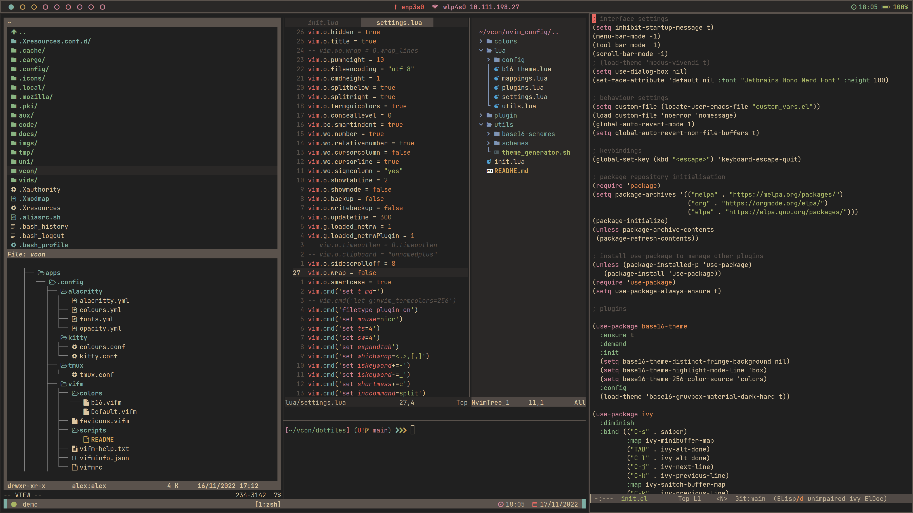
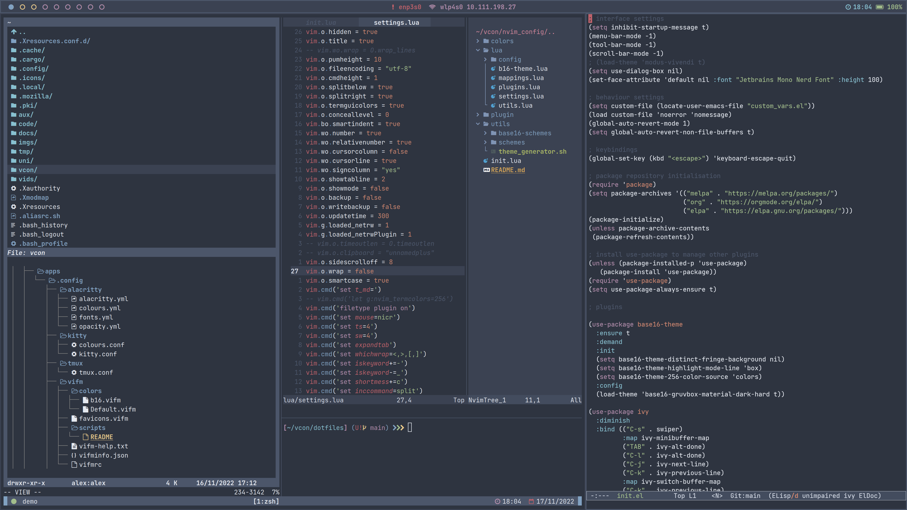

# Dotfiles

A version controlled repository for some of my system configuration files. The word *dotfile* refers to the leading `.` used to hide a file (eg. a configuration file) on most Unix systems. For an older more complete set of configuration files, have a look at [this repository](https://github.com/alexander-neville/config_archive), which I have deprecated and no longer use.

## Screenshots




## Deployment

For quick deployment on new machines, the files in this repository are organised in the fashion of *GNU Stow*, a symlink farm manager. Less attractive ways to manage deployment would involve either a messy deployment script or a lot of manual copying/symlinking. Stow, on the other hand, can automatically make and remove symlinks for files and directories. 

I have organised this project so that each subdirectory acts as a reference point to `~/`. Files positioned at a given point relative to each of these subdirectories will be placed in the same position relative to `~/` when *stowed*. Taking the X11 directory as an example, the files within will map to the same directory level / structure in the home directory if Stow is directed to do so.

```
./X11/ --> ~/
|--.xinitrc --> ~/.xinitrc
|--.Xmodmap
|--.Xresources
└--.Xresources.conf.d/
  |--colours --> ~/.Xresources.conf.d/colours
  └--schemes/
    |--scheme1 --> ~/.Xresources.conf.d/schemes/scheme1
    |--scheme2
    |--scheme3
    |--scheme4
    |--...
    └--schemeN
```
## My Configuration Files

I use two computers currently, a relatively modern Acer laptop running Arch and a 2005 ThinkPad T60 running Debian and Libreboot. I use this repository to keep important files on both devices in sync. Despite different package management models, I have no issues deploying the same setup on both distributions and devices. I routinely switch between 4K and HD external displays on my main laptop and I have a swtich to manage this when a graphical environment is started.

I am versioning my Emacs and Neovim configurations in separate repositories. Most other applications require less in the way of initialisation and so those plain text files are stored here. I have written some shell scripts that edit configuration files automatically, such as those for changing the terminal colour scheme. These automated changes should not be committed.

In the near future I plan to use some sort of reproducible declarative package managment tool, such as Nix or Guix. As mentioned above, I don't face any issues with version numbers at the moment, although I shouldn't count on this.
