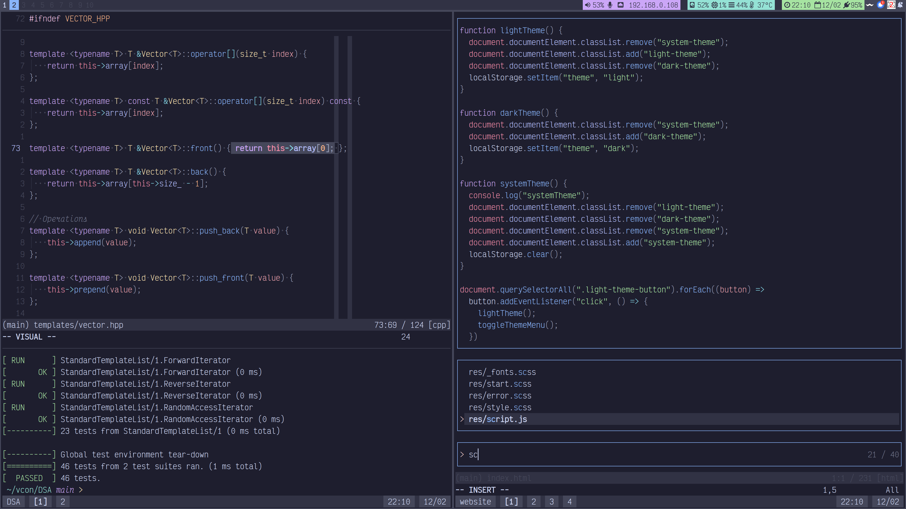
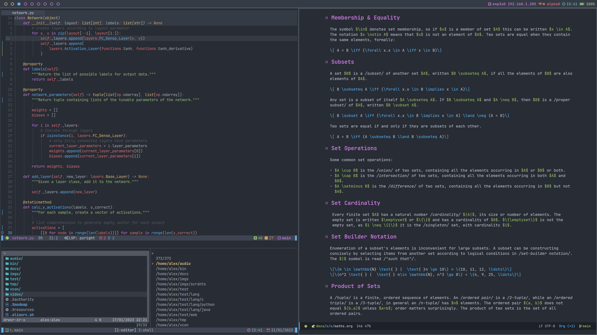
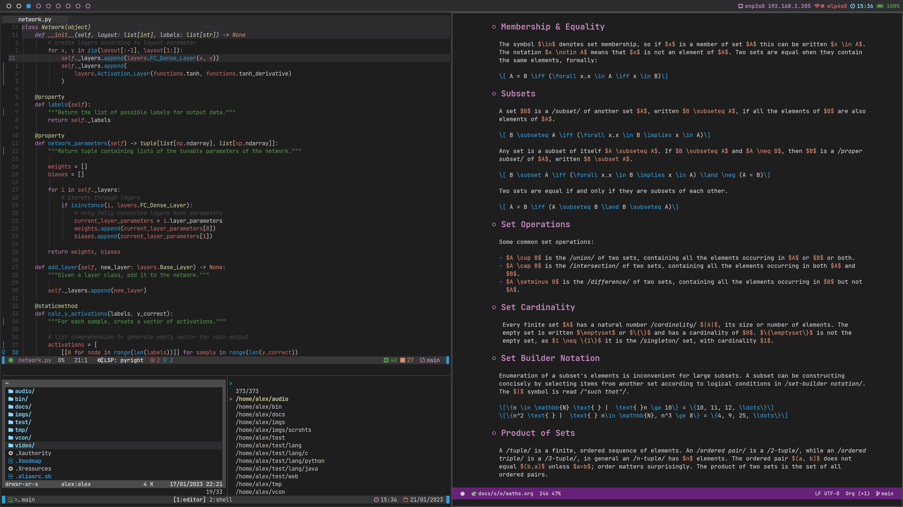
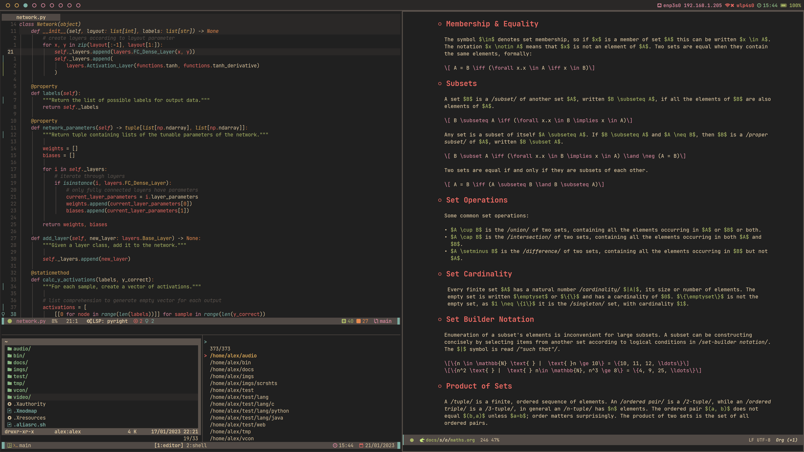

# Personal Configuration Files

This version control repository contains a selection of my system
configuration files. The word _dotfile_ is a colloquialism referring to
the leading `.` character used to hide a file on most Unix-like systems.

Initially, a single repository was sufficient for managing all of my
settings and configuration files, however I have since extracted certain
sections to independently versioned submodules:

- [My Neovim Configuration](https://github.com/afneville/nvim-config)
- [My Emacs Configuration](https://github.com/afneville/emacs-config)
- [My Theme Collection](https://github.com/afneville/b16-themes)

## Screenshots

- Wayland (Sway)
  ([main](https://github.com/afneville/dotfiles/tree/main))



- X11 (BSPWM)
  ([62c6aa1](https://github.com/afneville/dotfiles/tree/62c6aa14069445a6a77f61e61a72c85ce798d719))







## Deployment with Stow

For quick deployment on new machines, the files in this repository are
organised in the fashion of **GNU Stow**, a symlink farm manager. Less
convenient ways to manage deployment would involve either a messy
deployment script or a lot of manual copying and symlinking. Stow, on the
other hand, can automatically make and remove symlinks for both files
and directories.

I have organised this project so that each top-level subdirectory acts
as a reference to `~/`. Files positioned at a given point relative to
each of these directories will be placed in the same position relative
to `~/` when _stowed_. An example of `stow -t ~/ shell` invocation:

```text
./shell/ -> ~/
|--.bashrc -> ~/.bashrc
|--.zshnenv -> ~/.zshenv
`--.config/ -> ~/.config/
    `--zsh/ -> ~/.config/zsh/
        |--rc.sh -> ~/.config/zsh/rc.sh
        `--...
```

## Installation

Having cloned the repository and navigated into it, initialise the
submodules and _stow_ desired subdirectories to deploy the
configuration.

```text
git submodule update --init --remote --recursive
mkdir -p ~/.config/systemd/user
stow -t ~/ apps shell wm bin X11 submodules
stow -t ~/ --no-folding systemd
```
