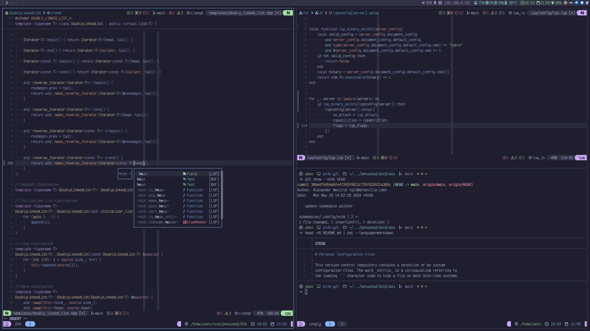

# Personal Configuration Files

This version control repository contains a selection of my system
configuration files - those that are impersonal and insensitive. The
word _dotfile_ is a colloquialism referring to the leading `.` character
used to hide a file in most Unix-like systems.

Initially, a single repository was sufficient for managing all of my
settings and configuration files, but, over time, different sections
grew to warrant repositories of their own, now included here as a
submodule. The original, archived repository - which I no longer use -
is [here](https://github.com/alexanderneville/config_archive). Other,
currently in use repositories are:

- [My Neovim Configuration](https://github.com/alexanderneville/nvim-config)
- [My Emacs Configuration](https://github.com/alexanderneville/emacs-config)
- [My Colour Themes](https://github.com/alexanderneville/b16-themes)

## Screenshots

- Wayland (Sway)
  [main](https://github.com/alexanderneville/dotfiles/tree/main)



- X11 (BSPWM)
  [45285b10](https://github.com/alexanderneville/dotfiles/tree/45285b104a26133633b52d3d702cfafe5407b046)


## Deployment with Stow

For quick deployment on new machines, the files in this repository are
organised in the fashion of **GNU Stow**, a symlink farm manager. Less
attractive ways to manage deployment would involve either a messy
deployment script or a lot of manual copying/symlinking. Stow, on the
other hand, can automatically make and remove symlinks for both files
and directories.

I have organised this project so that each subdirectory acts as a
reference point to `~/`. Files positioned at a given point relative to
each of these subdirectories will be placed in the same position
relative to `~/` when _stowed_. An example of `stow -t ~/ shell`
invocation:

```text
./shell/ -> ~/
|--.bashrc -> ~/.bashrc
|--.zshnenv -> ~/.zshenv
`--.config/ -> ~/.config/
    `--zsh/ -> ~/.config/zsh/
        |--rc.sh -> ~/.config/zsh/rc.sh
        `--...
```

## Installation

To install: clone the repository; initialise the submodules and stow the
relevant configuration _modules_ in the home directory.

```text
git clone https://github.com/alexanderneville/dotfiles.git
git submodule update --init --remote --recursive
stow -t ~/ apps shell wm bin X11 submodules
```
